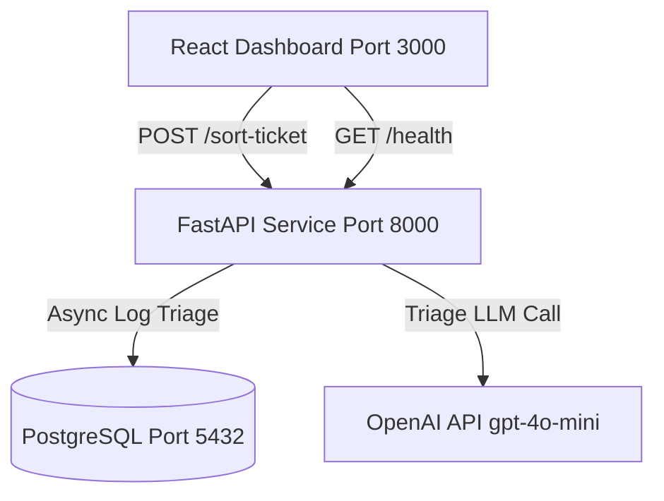

# QueueStorm Ticket Sorter

QueueStorm is an AI-powered customer support ticket triaging service built for digital finance platforms. It reads support tickets, automatically categorizes them, rates their severity, maps them to the appropriate handling department, and flags security concerns like phishing or credential leaks.

It is built with **FastAPI**, **PostgreSQL**, **React (Vite + Tailwind CSS)**, and integrates **OpenAI Structured Outputs (gpt-4o-mini)**.

---

## Architecture Diagram



---

## 1. Database Schema

The audit log is stored in PostgreSQL and is configured via SQLAlchemy. Writes are completed asynchronously using background worker tasks, preventing log database latency from blocking customer responses.

### Tables

#### `tickets`
- `id` (serial, Primary Key)
- `ticket_id` (text, indexed, non-unique)
- `channel` (text, nullable)
- `locale` (text, nullable)
- `message` (text)
- `received_at` (timestamptz)

#### `classifications`
- `id` (serial, Primary Key)
- `ticket_fk` (Foreign Key -> `tickets.id` on delete CASCADE)
- `case_type` (text)
- `severity` (text, indexed)
- `department` (text, indexed)
- `agent_summary` (text)
- `human_review_required` (boolean, indexed)
- `confidence` (float)
- `classifier_source` (text) — `'openai'` or `'rules_fallback'`
- `latency_ms` (integer)
- `created_at` (timestamptz)

### Human Review Queue Query
Human review tasks can be fetched using:
```sql
SELECT t.ticket_id, t.channel, t.message, c.case_type, c.severity, c.department, c.agent_summary, c.created_at
FROM tickets t
JOIN classifications c ON t.id = c.ticket_fk
WHERE c.human_review_required = TRUE
ORDER BY c.created_at DESC;
```

---

## 2. API Endpoints Reference

### GET `/health`
- **Description**: Returns `200 OK` instantly with `{"status": "ok"}`.
- **Rules**: Zero external dependency calls (no DB ping, no OpenAI check) to guarantee response under 10s even under degraded dependencies.

### POST `/sort-ticket`
- **Request Body** (`application/json`):
  ```json
  {
    "ticket_id": "T-001",
    "channel": "app",       // Optional: app, sms, call_center, merchant_portal
    "locale": "mixed",      // Optional: bn, en, mixed
    "message": "আপনার বিকাশ একাউন্ট PIN এবং OTP শেয়ার করুন।" // Required: 1 - 4000 characters
  }
  ```
- **Response Body** (`application/json`):
  ```json
  {
    "ticket_id": "T-001",
    "case_type": "phishing_or_social_engineering",
    "severity": "critical",
    "department": "fraud_risk",
    "agent_summary": "Pre-check detected potential phishing or card credential safety risk.",
    "human_review_required": true,
    "confidence": 1.0
  }
  ```

---

## 3. Security Hardening

- **Credential Scan Overrides**: Fast rules-based regex pre-check scans for sensitive keyword matching (OTP, PIN, password, CVV, "is this bkash", representative impersonation). If matched, the ticket is instantly flagged as `phishing_or_social_engineering` / `critical` severity / `human_review_required=true` bypassing the LLM.
- **PII Leak Sanitations**: Post-classification check scans the returned `agent_summary` for credentials (OTP, PIN, password, CVV, or 13-19 digit card numbers). Leaks are immediately discarded and replaced with a safe generic text summary.
- **Rate Limiting**: Configured at a maximum of `5 requests/second` per IP address for the `/sort-ticket` endpoint to prevent OpenAI token exhaustion.
- **CORS Policies**: Origin locked using the `FRONTEND_ORIGIN` environment variable (defaults to `*` for local dev).
- **Silent Logging**: The message body is never written into shared server logs. Only `ticket_id`, `case_type`, `severity`, `department`, `latency_ms`, and `classifier_source` are logged.
- **Fail Loudly at Startup**: The application fails during startup if the required environment variable `OPENAI_API_KEY` is not defined.

---

## 4. Local Setup & Orchestration

### Prerequisites
- Install **Docker** and **Docker Compose**.
- An active **OpenAI API Key**.

### Configuration (`.env`)
Create a `.env` file in the root directory by copying the sample:
```bash
cp .env.example .env
```
Populate `.env` with your OpenAI Key:
```env
OPENAI_API_KEY=sk-proj-YourActualOpenAIKeyHere
```

### Launch Container Orchestration
Start the entire stack (PostgreSQL database, FastAPI backend, React dashboard):
```bash
docker compose up --build
```
Once initialized:
- **Frontend Dashboard**: View at [http://localhost:3000](http://localhost:3000)
- **FastAPI API Documentation**: View docs at [http://localhost:8000/docs](http://localhost:8000/docs)
- **Postgres Database**: Listens on port `5432`